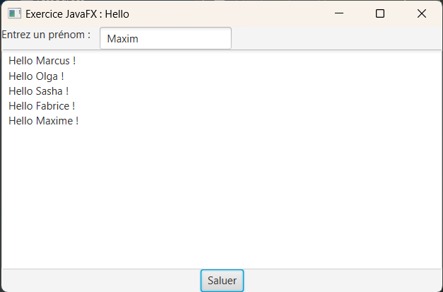
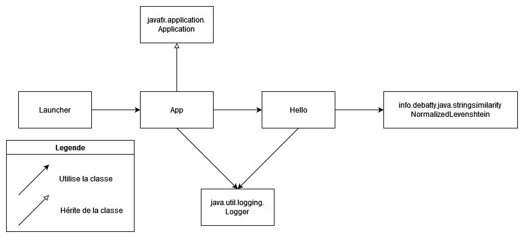
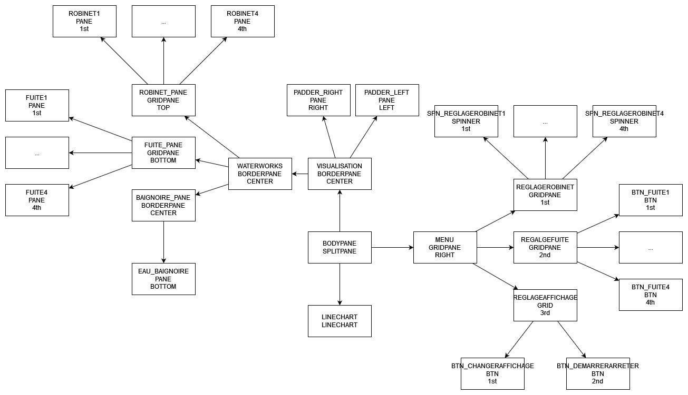

# Projet POO-javafx
Ce projet est un projet scolaire qui permet d'expérimenter avec Maven et javafx.
L'idée est de réprésenter une baignoire avec des fuites et des robinets qui la remplissent
On définit un nombre de robinets et de fuite < 4 puis on lance la simulation
On peut changer le débit de chaque robinet et supprimer certaines fuites
Lorsque la baignoire est remplie, on arrête la simulation et affiche le temps pris et l'eau gaspillé.
Ce projet est censé prendre un temps d'environ : 8h
Ce projet à pris un temps de : 8h15

## Auteurs :
Projet crée par Marcus Richier, suivant les cours de Azim Roussalany.

## Version :
Testé pour java 17.

## Necessite pour l'installation :

- Java 17
- Maven

## Installation :

- Allez a la racine du projet
- Installez avec : "mvn package"

## Utilisation :

- Lancez avec "./bindist/bin/hello"

## Conception de l'architecture :

## Conception graphique :

## Licence MIT :
