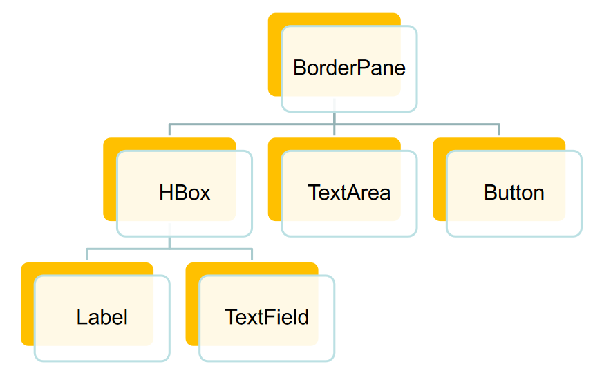

# Projet POO-javafx
Ce projet est un projet scolaire qui permet d'expérimenter avec Maven et javafx.
L'idée est de réprésenter une baignoire avec des fuites et des robinets qui la remplissent
On définit un nombre de robinets et de fuite < 4 puis on lance la simulation
On peut changer le débit de chaque robinet et supprimer certaines fuites
Lorsque la baignoire est remplie, on arrête la simulation et affiche le temps pris et l'eau gaspillé.
Ce projet est censé prendre un temps d'environ : 8h
Ce projet à pris un temps de : 1h55

## Auteurs :
Projet crée par Marcus Richier, suivant les cours de Azim Roussalany.

## Version :
Testé pour java 17.

## Necessite pour l'installation :

- Java 17
- Maven

## Installation :

- Allez a la racine du projet
- Installez avec : "mvn package"

## Utilisation :

- Lancez avec "./bindist/bin/hello"

## Algorithme utilisé :
- Distance de Levenshtein

## Conception de l'architecture :

## Conception graphique :

## Licence MIT :
« Copyright © 2024, Marcus Richier

Permission is hereby granted, free of charge, to any person obtaining a copy of this software and associated documentation files (the “Software”), to deal in the Software without restriction, including without limitation the rights to use, copy, modify, merge, publish, distribute, sublicense, and/or sell copies of the Software, and to permit persons to whom the Software is furnished to do so, subject to the following conditions:

The above copyright notice and this permission notice shall be included in all copies or substantial portions of the Software.

The Software is provided “as is”, without warranty of any kind, express or implied, including but not limited to the warranties of merchantability, fitness for a particular purpose and noninfringement. In no event shall the authors or copyright holders X be liable for any claim, damages or other liability, whether in an action of contract, tort or otherwise, arising from, out of or in connection with the software or the use or other dealings in the Software.
Except as contained in this notice, the name of the Marcus Richier shall not be used in advertising or otherwise to promote the sale, use or other dealings in this Software without prior written authorization from the Marcus Richier. »
